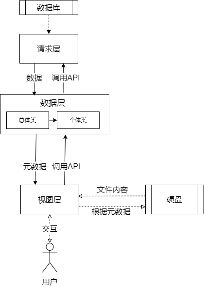

#

## 基于web的桌面端电子书阅读器

### 技术选型

### 支持功能

搜索，添加文件，批量添加，收藏，文件夹，书签，注释，标记

### 项目架构

架构中的每一层都只能访问相邻层

#### 请求层

继承基类RequestOperator。
负责请求数据并将其返回给*数据层*，请求的目标可以是数据库、服务器、文件等。无论请求目标是什么，暴露给*数据层*的api都需统一，以便*数据层*的切换。

#### 数据层

负责根据视图的切换向*请求层*请求数据;储存*请求层*返回的数据，并返回给*视图层*;根据用户的交互向请求层发出修改数据的请求。
可细分为*总体类*和*个体类*。
>**e.g.** 以电子书为例，总体类为多个书籍对象的集合，存放的是这些书籍对象的元数据。个体类为某一本书的详细数据，包含这本书的元数据与详细内容。

##### 总体类

继承基类DataOperator。
*总体类*存储的数据应为元数据，不会根据*视图层*需要做出修改

##### 个体类

由*总体类*产生，可根据不同的对象实体自由实现。

#### 视图层

负责展示UI界面，并与用户交互。根据需要从*数据层*请求数据。

>应在*视图层*根据ui需要对元数据进行处理

****

### 文件结构

#### `component` *视图层*文件，即react组件

- `Reader` 电子书阅读器组件
  - `index` 主页面组件
  - `BookContent` 文本阅读组件
  - `style` 全局组件的样式
  - `*.tsx` 全局组件
- `Gallery` 图片阅读器组件，为额外功能，相关内容不做进一步说明

#### `config` 程序中的参数配置文件

#### `hooks` 自定义hooks

#### `icon` 图标

#### `ipc` electron文件

#### `types` 定义的类型文件

#### `utils` 非视图的工具类，包括*请求层*、*数据层*以及一些数据结构的定义

- `requestOperator.ts` 定义*请求层*基类RequestOperator，接口，不定义具体功能
- `dataOperator.ts` 定义*数据层*基类DataOperator，所有*数据层*对象均继承自该类
- `readerOperator.ts` 定义书籍的*数据层*管理类readerOperator
- `mysqlOperator.ts` 定义连接至mysql的*请求层*对象mysqlOperator
- `sqliteOperator.ts` 定义连接至sqlite的*请求层*对象sqliteOperator
- `functions` 工具函数
  - `comPressThumb.ts` 用于压缩图像，生成缩略图。在gallery组件中使用。
  - `functions.ts` 普通工具函数
  - `process.ts` 需要调用系统功能的函数
  - `typeAssertion.ts` 类型断言函数

### 功能说明

见[功能说明](./doc/功能说明.md)
